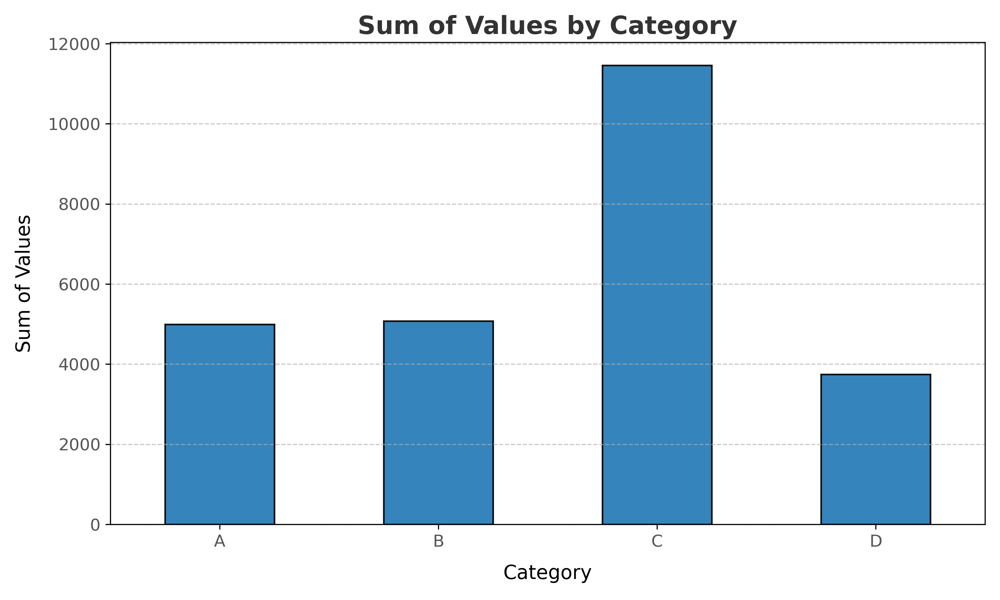
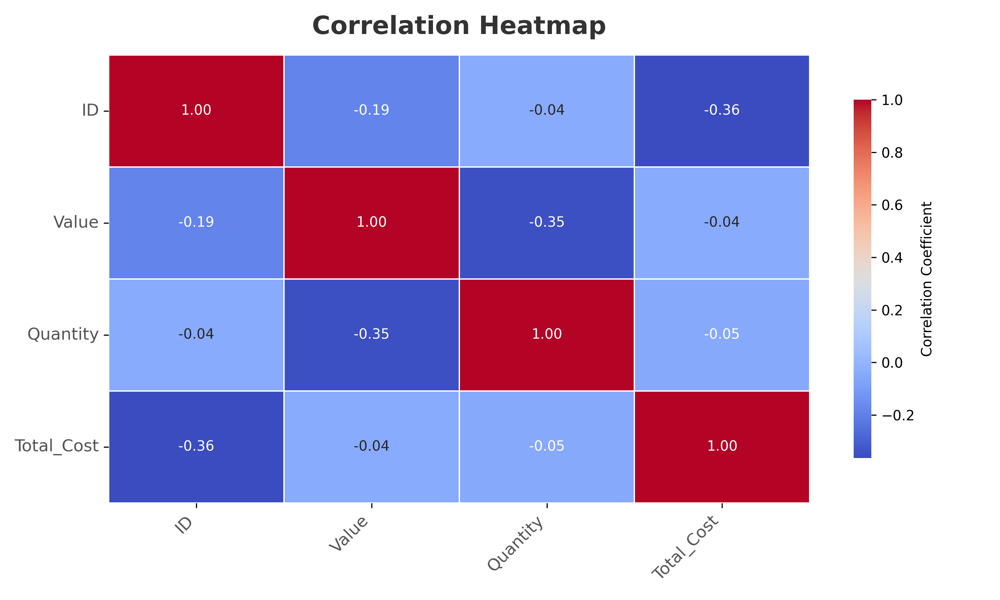
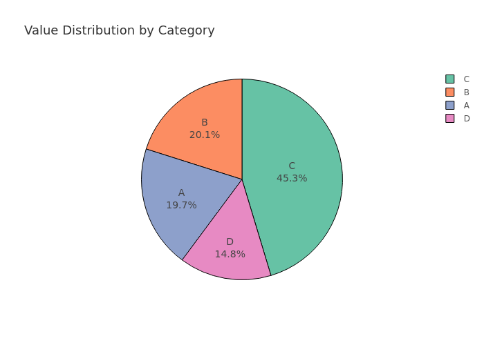

# Data Analysis Scripts Demo

Welcome to the **Data Analysis Scripts Demo** repository! This project provides a demo version of advanced data analysis tools designed for data scientists, healthcare professionals, small business owners, and freelancers.

---

## 🚀 Features

- **Data Cleaning**: Handle missing values, outliers, and data formatting.
- **Data Visualization**: Generate bar plots, heatmaps, and pie charts using Matplotlib, Seaborn, and Plotly.
- **Realistic Datasets**: Synthetic data tailored for healthcare, business, and freelancing.
- **Interactive Examples**: Hands-on Jupyter Notebooks demonstrating real-world use cases.

---

## 📊 Sample Visualizations

### Bar Plot


### Heatmap


### Pie Chart


---

## 📂 Repository Structure

```plaintext
Data-Analysis-Scripts-Demo/
├── README.md                    # Project overview
├── LICENSE                      # Licensing information
├── requirements.txt             # Python dependencies
├── lite_demo/                   # Demo scripts and data
│   ├── demo_data.csv            # Sample dataset
│   ├── demo_script.py           # Demo script for analysis
│   ├── demo_visualizations/     # Saved visualizations
│   │   ├── bar_plot.png
│   │   ├── heatmap.png
│   │   └── pie_chart.png
│   └── generate_demo_data.py    # Script to generate demo data
└── setup_instructions.md        # Setup and usage guide

# 🛠 How to Set Up

## 1 Clone the repository:

git clone https://github.com/Seid-M-Adem/Data-Analysis-Scripts-Demo-.git
cd Data-Analysis-Scripts-Demo-

## 2 Install dependencies:
    pip install -r requirements.txt

## 3 Run the demo script:
    python lite_demo/demo_script.py

# 🌟 Next Steps

**For the full version with more features, datasets, and support, visit seiddata.com.
# 🔒 License

This repository is licensed under the MIT License. See the LICENSE file for more details.

# 📧 Contact

**For support or inquiries, feel free to reach out at info@seiddata.com.


---

### **How to Use This File**

1. Copy the content above into your `README.md` file in the repository.
2. Commit and push the changes:
   ```bash
   git add README.md
   git commit -m "Update README with detailed project overview"
   git push origin main
